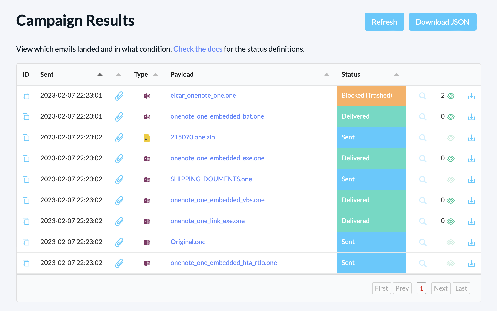

# Detections

This repo serves as a home for detection content developed by the [delivr.to](https://delivr.to) team.

All rules present in this repo have corresponding payloads (linked in references and shown below) that can be used to test detection content.

The repo currently holds the following types of detections:

- [Sublime Rules](#sublime-rules)
- [Yara Rules](#yara-rules)
- [Sigma Rules](#sigma-rules)

## Sublime Rules

Below is the list of rules for Sublime Security, organised into [General](sublime-rules/general/) and [Threat Intel](sublime-rules/threatintel/) specific folders.

You can also integrate delivr.to directly with Sublime as mentioned [here](https://blog.delivr.to/introducing-delivrto-7a8840ff5ed5) and documented [here](https://docs.delivr.to/docs/integrations/sublime_integration.html).

| Rule Name                                            | Type       | Payload 	| 
|------------------------------------------------------|------------|----------	| 
| [Body: Img Element Exploiting CVE-2024-38021 (Unsolicited)](sublime-rules/threatintel/body_cve_2024_38021.yml ) 	               | Threat Intel    |           | 
| [Link: PIF File from Suspicious Source (AgentTesla)](sublime-rules/threatintel/link_agenttesla_pif.yml ) 	               | Threat Intel    |           | 
| [Attachment: HTML with search-ms URI protocol handler (DarkGate)](sublime-rules/threatintel/attachment_html_search_ms.yml ) 	               | Threat Intel    |           | 
| [Attachment: HTML with Meta Tag Refresh and File Protocol Handler (Pikabot)](sublime-rules/threatintel/attachment_html_meta_refresh.yml ) 	               | Threat Intel    |           | 
| [Attachment: PDF Link with Microsoft OneDrive Branding (Pikabot)](sublime-rules/threatintel/attachment_pdf_with_onedrive_pikabot_lure.yml ) 	               | Threat Intel    |           | 
| [Attachment: ZIP Containing LNK Minimized One-Liner (Unsolicited)](sublime-rules/threatintel/attachment_lnk_oneliner.yml ) 	               | Threat Intel    |           | 
| [Attachment: HTML Smuggling of Zip File with Evasion Indicators (Unsolicited)](sublime-rules/threatintel/attachment_html_smuggling_zip_with_evasion.yml ) 	               | Threat Intel    |           | 
| [Attachment: PDF with embedded MHT using ActiveMime objects (Unsolicited)](sublime-rules/threatintel/attachment_pdf_activemime_polyglot.yml) 	               | Threat Intel    |           | 
| [Attachment: Zip Exploiting CVE-2023-38831 (Unsolicited)](sublime-rules/threatintel/attachment_cve_2023_38831.yml) 	               | Threat Intel    |           | 
| [Attachment: PDF with Auto-Open Embedded Smuggling File](sublime-rules/threatintel/attachment_pdf_with_embedded_smuggling_file.yml) 	               | Threat Intel    |           | 
| [Attachment: OneNote file with Suspicious Strings](sublime-rules/threatintel/attachment_onenote_suspicious_strings.yml) 	               | Threat Intel    |           | 
| [Link: Zipped OneNote file with Document Download Lure (QakBot)](sublime-rules/threatintel/link_qakbot_zipped_onenote_doc_download_lure.yml) 	               | Threat Intel    |           | 
| [Attachment: OneNote containing HTA with VBScript and JavaScript content (QakBot)](sublime-rules/threatintel/attachment_qakbot_onenote_with_hta_containing_javascript_vbscript.yml) 	               | Threat Intel    |           |
| [Attachment: WSF File With Certificate Content (QakBot)](sublime-rules/threatintel/attachment_wsf_cert_file.yml) 	               | Threat Intel    |           |
| [Attachment: PDF with Document Download Lure](sublime-rules/threatintel/attachment_pdf_with_document_download_lure.yml) 	               | Threat Intel    |           |
| [Attachment: PDF with Embedded Google Firebase Storage Link (Bumblebee)](sublime-rules/threatintel/attachment_pdf_with_firebase_link.yml) 	               | Threat Intel    |           |
| [Attachment: Office Document with Embedded RTF Referencing Remote Resources CVE-2023-36884 (Unsolicited)](sublime-rules/threatintel/attachment_cve_2023_36884.yml) 	               | Threat Intel    |        | 
| [Attachment: HTML smuggling with Google Web Toolkit (GWT)](sublime-rules/general/attachment_html_file_with_gwt.yml ) 	               | General    |           | 
| [Attachment: HTML smuggling with WebAssembly (Wasm)](sublime-rules/general/attachment_html_file_with_wasm.yml ) 	               | General    |           | 
| [Attachment: ZPAQ Archive (Unsolicited)](sublime-rules/general/attachment_zpaq_archive_unsolicited.yml) 	               | General    |           | 
| [Attachment: Microsoft-branded HTML File (Unsolicited)](sublime-rules/general/attachment_microsoft_branded_html.yml) 	               | General    |           | 
| [Attachment: HTML file without HTML element (Unsolicited)](sublime-rules/general/attachment_html_file_without_html_elements.yml) 	               | General    |           | 
| [Attachment: SVG file with Onerror or Onload (Unsolicited)](sublime-rules/general/attachment_svg_with_onload_onerror.yml) 	               | General    |           | 
| [Attachment: SVG file with Script Tags (Unsolicited)](sublime-rules/general/attachment_svg_with_script_element.yml) 	               | General    |           | 
| [Attachment: HTML file with eval function and long byte string (Unsolicited)](sublime-rules/general/attachment_html_eval_byte_string.yml) 	               | General    |           | 
| [Attachment: HTML File Containing Recipient Email Address (Unsolicited)](sublime-rules/general/attachment_html_file_with_recipient_email.yml) 	               | General    |           | 
| [Attachment: Extended HTML File Format (Unsolicited)](sublime-rules/general/attachment_xhtml.yml ) 	               | General    |           | 
| [Attachment: Microsoft Script Encoding Content](sublime-rules/general/attachment_microsoft_script_encoding_content.yml ) 	               | General    |           | 
| [Link: Zipped OneNote file](sublime-rules/general/link_zipped_onenote.yml) 	               | General    |           | 
| [Link: OneNote file](sublime-rules/general/link_onenote.yml) 	               | General    |           | 
| [Link: Brand Impersonation Phishing Site](sublime-rules/general/link_brand_impersonation_phishing_site.yml) 	               | General    |           | 
| [Link: Zipped Script File (Unsolicited)](sublime-rules/general/attachment_autoit.yml) 	               | General    |           | 
| [Attachment: Remote Template Injection](sublime-rules/general/attachment_remote_template_injection.yml) 	               | General    |           | 
| [Attachment: HTML Smuggling with msSaveOrOpenBlob](sublime-rules/general/attachment_mssaveoropenblob.yml) 	               | General    |           | 
| [Attachment: AutoIt Script File (Unsolicited)](sublime-rules/general/link_zipped_script.yml) 	               | General    |           | 
| [Attachment: Microsoft Word SMB-hosted Remote Template Injection](sublime-rules/general/attachment_smb_remote_template_injection.yml) | General |  |

## Yara Rules

Below is the list of Yara rules in the repo. 

| Rule Name                                            | Type       | Payload 	| 
|------------------------------------------------------|------------|----------	| 
| [SUSP_HTML_WASM_Smuggling](yara-rules/html_wasm.yar)	               | General    |           | 
| [SUSP_HTML_B64_WASM_Blob](yara-rules/html_wasm.yar)	               | General    |           | 
| [SUSP_ZPAQ_Archive_Nov23](yara-rules/zpaq_archives.yar)	               | General    |           | 
| [SUSP_PDF_MHT_ActiveMime_Sept23](yara-rules/pdf_mht_activemime.yar)	               | General    |           | 
| [SUSP_SVG_Onload_Onerror_Jul23](yara-rules/svg_onload_onerror.yar)	               | General    |           | 
| [SUSP_OneNote_Repeated_FileDataReference_Feb23](yara-rules/onenote_repeated_files.yar)	               | Threat Intel    |           | 
| [SUSP_OneNote_RTLO_Character_Feb23](yara-rules/onenote_rtlo_filename.yar)	               | Threat Intel    |           | 
| [SUSP_OneNote_Win_Script_Encoding_Feb23](yara-rules/onenote_windows_script_encoding_file.yar )	               | Threat Intel    |           | 
| [SUSP_msg_CVE_2023_23397_Mar23](yara-rules/msg_cve_2023_23397.yar )	               | Threat Intel    |           | 
| [SUSP_CONCAT_ZIP_Nov24](yara-rules/concatenated_zip.yar )	               | Threat Intel    |           | 

## Sigma Rules

Below is the list of Sigma rules in the repo.

| Rule Name                                            | Type       | Payload 	| 
|------------------------------------------------------|------------|----------	| 
| [PDF HTML Smuggling](sigma-rules/file_event_win_pdf_html_smuggle.yml)	               | Threat Intel    |           | 
